# terraform-app
This repository is for store the terraform code of our app for all envs.

## Infrastructure diagram

_Auto-generated by `make diagrams` — do not edit between the markers._

<!-- BEGIN_DIAGRAM -->
### `terraform-app`

[Abrir como SVG](docs/diagrams/terraform-app.svg)

```mermaid
flowchart LR
  classDef network fill:#E3F2FD,stroke:#1E88E5,color:#0D47A1;
  classDef compute fill:#FFF3E0,stroke:#FB8C00,color:#E65100;
  classDef data fill:#E8F5E9,stroke:#43A047,color:#1B5E20;
  classDef security fill:#FCE4EC,stroke:#E53935,color:#B71C1C;
  classDef observability fill:#F3E5F5,stroke:#8E24AA,color:#4A148C;
  classDef other fill:#ECEFF1,stroke:#78909C,color:#37474F;
  subgraph root["terraform-app · raiz"]
    n_aws_ecr_lifecycle_policy_nginx["ECR Lifecycle Policy - nginx"]:::data
    n_aws_ecr_repository_nginx["ECR Repository - nginx"]:::data
    n_aws_security_group_ecs_app["Security Group - ecs_app"]:::security
    n_aws_security_group_vpc_endpoints["Security Group - vpc_endpoints"]:::security
    n_aws_subnet_app["Subnet - app"]:::network
    n_aws_subnet_data["Subnet - data"]:::network
    n_aws_subnet_public["Subnet - public"]:::network
    n_aws_vpc_app_vpc["VPC - app_vpc"]:::network
    n_aws_vpc_endpoint_interface["VPC Endpoint - interface"]:::network
    n_aws_vpc_endpoint_s3["VPC Endpoint - s3"]:::network
  end
  subgraph mod_n_dynamo_customer_registration["Módulo - dynamo_customer_registration"]
    n_module_dynamo_customer_registration_aws_dynamodb_table_this["DynamoDB Table - this"]:::data
  end
  subgraph mod_n_ecs_app_customer_registration["Módulo - ecs_app_customer_registration"]
    n_module_ecs_app_customer_registration_aws_cloudwatch_log_group_ecs_logs["CloudWatch Log Group - ecs_logs"]:::observability
    n_module_ecs_app_customer_registration_aws_ecs_service_this["ECS Service - this"]:::compute
    n_module_ecs_app_customer_registration_aws_ecs_task_definition_this["ECS Task Definition - this"]:::compute
    n_module_ecs_app_customer_registration_aws_iam_role_ecs_task_execution_role["IAM Role - ecs_task_execution_role"]:::security
    n_module_ecs_app_customer_registration_aws_iam_role_policy_ecs_task_execution_policy["IAM Role Policy - ecs_task_execution_policy"]:::security
  end
  subgraph mod_n_ecs_app_product_registration["Módulo - ecs_app_product_registration"]
    n_module_ecs_app_product_registration_aws_cloudwatch_log_group_ecs_logs["CloudWatch Log Group - ecs_logs"]:::observability
    n_module_ecs_app_product_registration_aws_ecs_service_this["ECS Service - this"]:::compute
    n_module_ecs_app_product_registration_aws_ecs_task_definition_this["ECS Task Definition - this"]:::compute
    n_module_ecs_app_product_registration_aws_iam_role_ecs_task_execution_role["IAM Role - ecs_task_execution_role"]:::security
    n_module_ecs_app_product_registration_aws_iam_role_policy_ecs_task_execution_policy["IAM Role Policy - ecs_task_execution_policy"]:::security
  end
  subgraph mod_n_ecs_cluster["Módulo - ecs_cluster"]
    n_module_ecs_cluster_aws_ecs_cluster_this["ECS Cluster - this"]:::compute
  end
  n_aws_ecr_lifecycle_policy_nginx --> n_aws_ecr_repository_nginx
  n_aws_security_group_ecs_app --> n_aws_vpc_app_vpc
  n_aws_security_group_vpc_endpoints --> n_aws_vpc_app_vpc
  n_aws_subnet_app --> n_aws_vpc_app_vpc
  n_aws_subnet_data --> n_aws_vpc_app_vpc
  n_aws_subnet_public --> n_aws_vpc_app_vpc
  n_aws_vpc_endpoint_interface --> n_aws_security_group_vpc_endpoints
  n_aws_vpc_endpoint_interface --> n_aws_subnet_app
  n_aws_vpc_endpoint_s3 --> n_aws_vpc_app_vpc
  n_module_ecs_app_customer_registration_aws_ecs_service_this --> n_module_ecs_app_customer_registration_aws_ecs_task_definition_this
  n_module_ecs_app_customer_registration_aws_ecs_service_this --> n_module_ecs_app_customer_registration_aws_iam_role_policy_ecs_task_execution_policy
  n_module_ecs_app_customer_registration_aws_ecs_task_definition_this --> n_module_ecs_app_customer_registration_aws_cloudwatch_log_group_ecs_logs
  n_module_ecs_app_customer_registration_aws_ecs_task_definition_this --> n_module_ecs_app_customer_registration_aws_iam_role_ecs_task_execution_role
  n_module_ecs_app_customer_registration_aws_iam_role_policy_ecs_task_execution_policy --> n_module_ecs_app_customer_registration_aws_cloudwatch_log_group_ecs_logs
  n_module_ecs_app_customer_registration_aws_iam_role_policy_ecs_task_execution_policy --> n_module_ecs_app_customer_registration_aws_iam_role_ecs_task_execution_role
  n_module_ecs_app_product_registration_aws_ecs_service_this --> n_module_ecs_app_product_registration_aws_ecs_task_definition_this
  n_module_ecs_app_product_registration_aws_ecs_service_this --> n_module_ecs_app_product_registration_aws_iam_role_policy_ecs_task_execution_policy
  n_module_ecs_app_product_registration_aws_ecs_task_definition_this --> n_module_ecs_app_product_registration_aws_cloudwatch_log_group_ecs_logs
  n_module_ecs_app_product_registration_aws_ecs_task_definition_this --> n_module_ecs_app_product_registration_aws_iam_role_ecs_task_execution_role
  n_module_ecs_app_product_registration_aws_iam_role_policy_ecs_task_execution_policy --> n_module_ecs_app_product_registration_aws_cloudwatch_log_group_ecs_logs
  n_module_ecs_app_product_registration_aws_iam_role_policy_ecs_task_execution_policy --> n_module_ecs_app_product_registration_aws_iam_role_ecs_task_execution_role
  mod_n_ecs_app_customer_registration ==>|usa| mod_n_ecs_cluster
  mod_n_ecs_app_product_registration ==>|usa| mod_n_ecs_cluster
  mod_n_ecs_app_customer_registration -. usa .-> n_aws_ecr_repository_nginx
  mod_n_ecs_app_customer_registration -. usa .-> n_aws_security_group_ecs_app
  mod_n_ecs_app_customer_registration -. usa .-> n_aws_subnet_app
  mod_n_ecs_app_product_registration -. usa .-> n_aws_ecr_repository_nginx
  mod_n_ecs_app_product_registration -. usa .-> n_aws_security_group_ecs_app
  mod_n_ecs_app_product_registration -. usa .-> n_aws_subnet_app
  subgraph legenda["Legenda"]
    direction LR
    leg_network["Rede"]:::network
    leg_compute["Compute"]:::compute
    leg_data["Dados / Registro"]:::data
    leg_security["Segurança / IAM"]:::security
    leg_observability["Observabilidade"]:::observability
  end
  style root fill:#FAFAFA,stroke:#E0E0E0;
  style mod_n_dynamo_customer_registration fill:#FAFAFA,stroke:#CFD8DC;
  style mod_n_ecs_app_customer_registration fill:#FAFAFA,stroke:#CFD8DC;
  style mod_n_ecs_app_product_registration fill:#FAFAFA,stroke:#CFD8DC;
  style mod_n_ecs_cluster fill:#FAFAFA,stroke:#CFD8DC;
  style legenda fill:#FFFFFF,stroke:#E0E0E0;
```

<!-- END_DIAGRAM -->
